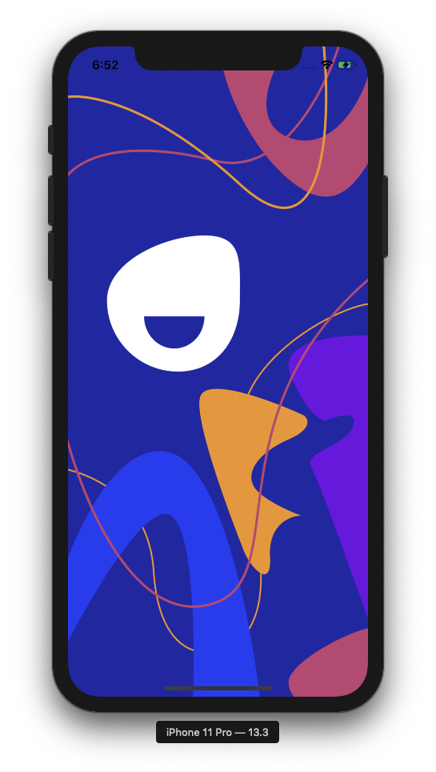
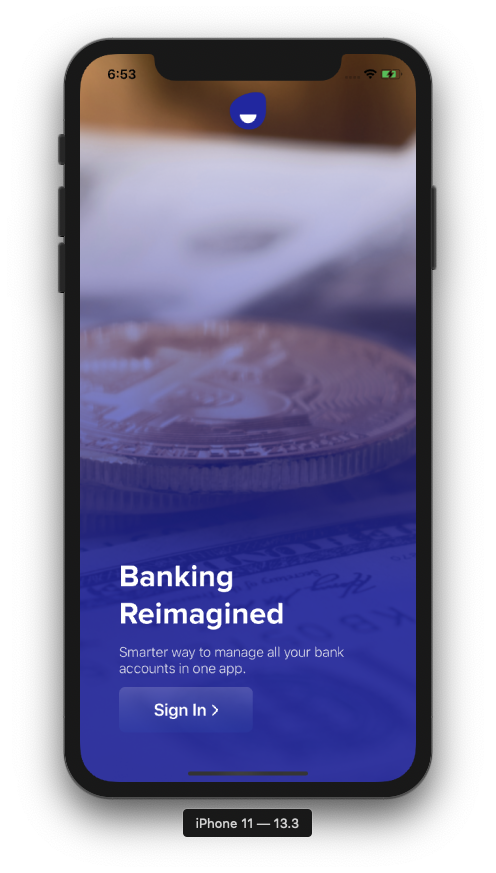
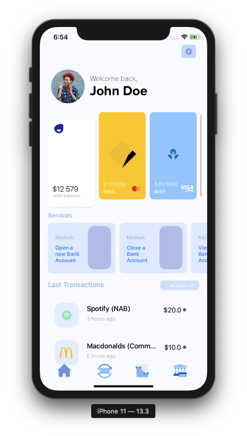

<h1 align="Center">
   
    1Bank 
</h1>

Too many bank applications to handle?  Unclear view of their banking tendencies?   <b>1Bank</b> is an iOS application that hand Control your income and expenses, get smart analysis, all through our seamless user experience.
 🌆  

## What problems lead us to make 1Bank ##
🌀 Too many bank accounts to handle 
😕 Unclear view of our banking tendencies 
🏷️ Banks only have a partial idea of a customer's spending habits 

## What inspired us 💡 ##

- This is possible by the new API that the australian governmnet going to release called <b>Open Banking</b>.

- Open banking centers on the idea that you deserve to have complete access to the consumer data that is collected by banks and financial institutions. More info: https://accntu.re/33BW3qa

## 👥 Benefits to the User 

- All your accounts in 1 platform

&nbsp;&nbsp;&nbsp;&nbsp;&nbsp;&nbsp;Clear and concise views to ease your banking experience

- Better exposure to different banks

&nbsp;&nbsp;&nbsp;&nbsp;&nbsp;&nbsp;View various account types across all banks to suit your needs

- Easier account management

&nbsp;&nbsp;&nbsp;&nbsp;&nbsp;&nbsp;Open and close all of your accounts with the click of a button

## 🏦 Benefits to Banks 

- A clearer picture of your customer
- Limitless potential with a customer's aggregated data across multiple banks
- More users, more revenue

&nbsp;&nbsp;&nbsp;&nbsp;&nbsp;&nbsp;A new exciting platform to entice more customers

- View the Presentation here :- <a href="https://www.canva.com/design/DADsrsum_hc/hPbIPO_Jv9ZpuENW04mh4A/view?utm_content=DADsrsum_hc&utm_campaign=designshare&utm_medium=link&utm_source=sharebutton"> Presentation </a>

## Built With ⚒️
- [Swift](https://developer.apple.com/swift/) - Swift is a powerful and intuitive programming language for macOS, iOS, watchOS, tvOS and beyond. Writing Swift code is interactive and fun, the syntax is concise yet expressive, and Swift includes modern features developers love.  
- [Python](https://www.python.org/) - Python is an interpreted, high-level, general-purpose programming language. Created by Guido van Rossum and first released in 1991, Python's design philosophy emphasizes code readability with its notable use of significant whitespace.
- [Figma](http://www.figma.com/) - Figma is an interface design application that runs in the browser–but it’s actually much more than that. I would go so far as to say it’s probably the best application for team-based collaborative design projects.

## Team
- [Gayuru Gunawardena](https://gayurug.com/)
- [Sogyal Sherpa](https://github.com/sogyals429)
- [Liza Tawaf](https://github.com/lizatawaf)
- [Nicholas Chong](https://github.com/nchong128)
